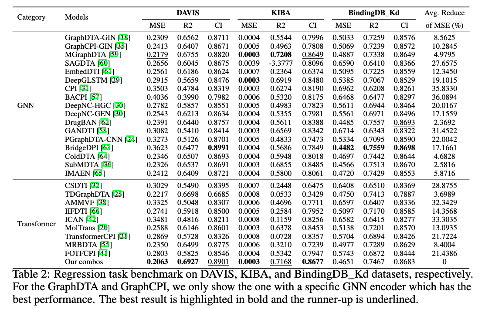
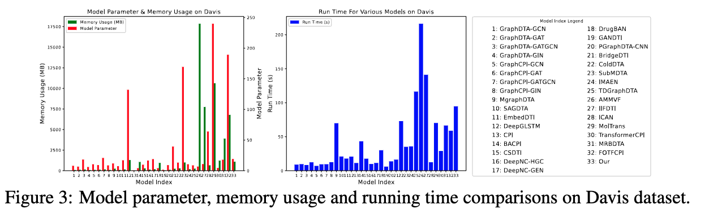
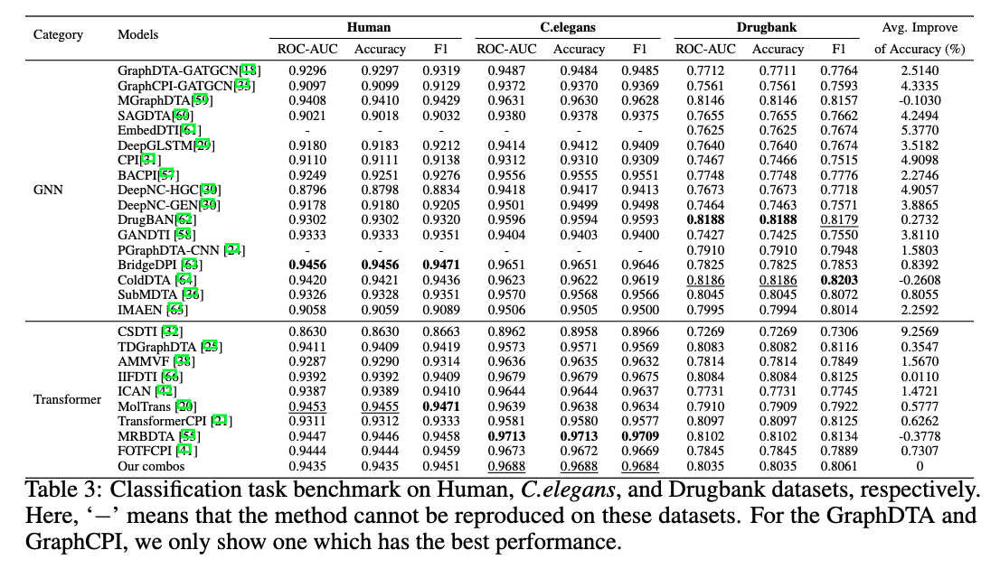
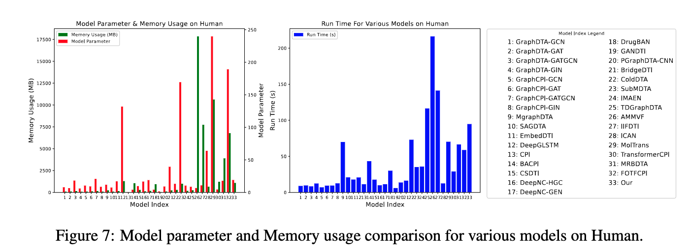

# Benchmark on Drug Target Interaction Modeling from a Structure Perspective

This is the official codebase of the paper [Benchmark on Drug Target Interaction Modeling from a Structure Perspective](https://arxiv.org/pdf/2407.04055v1).

GTB-DTI is a comprehensive benchmark customized for GNN and
Transformer-based methodologies for DTI prediction.

## Reproduction
Before you begin, you can install the required libraries using:

First, clone the repository to your local machine:
```bash
git clone https://github.com/justinwjl/GTB-DTI.git
cd your-repo
```

### Traning the Model
```python
python main.py -c config/model.yaml
```

The config.yaml file contains all the configurable parameters for training the model. You can edit this file to adjust parameters such as learning rate, batch size, and number of epochs.

### Memory Evaluation

Set the 'train' to 'memory_test' in the config.yaml file
```bash
task:
  class: regression
  model:
    class: model
    param: 
  train: memory_test
```


## Benchmark Result
### Benchmark of Regression task




### Benchmark of Classification task




## License
This codebase is released under the MIT License as in the [LICENSE](LICENSE) file.

## Citation
If you find this paper or code helpful in your research, please cite the following paper.

```
@misc{zhang2024benchmarkdrugtargetinteraction,
      title={Benchmark on Drug Target Interaction Modeling from a Structure Perspective}, 
      author={Xinnan Zhang and Jialin Wu and Junyi Xie and Tianlong Chen and Kaixiong Zhou},
      year={2024},
      eprint={2407.04055},
      archivePrefix={arXiv},
      primaryClass={q-bio.QM},
      url={https://arxiv.org/abs/2407.04055}, 
}
```